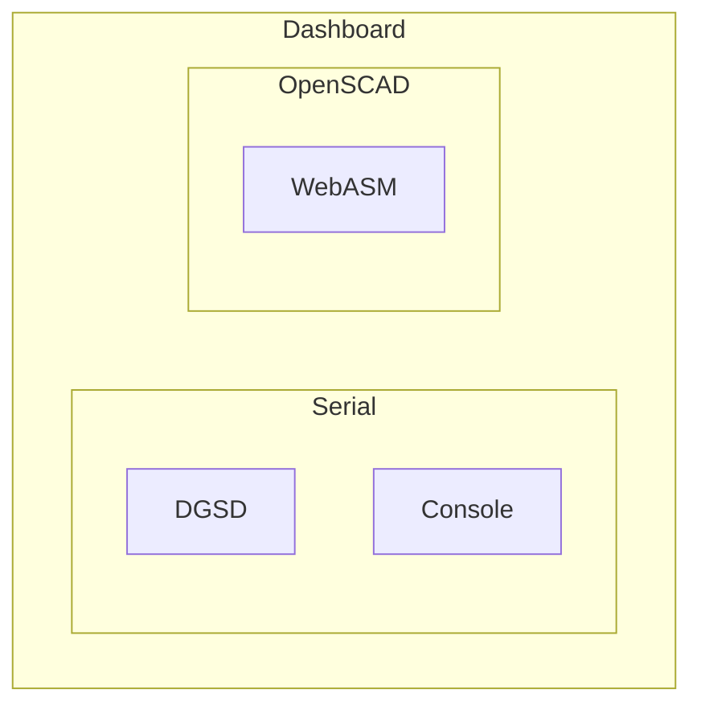

# Diagnostic Tools

Top-level entry point for Diagnostics tools.

## Frame Structure

Initial thoughts

e.g. route navigation

- The outer frame navgation entry is https://diagnosticsmonkey.github.io/Tool-Dashboard/
- serial entry is https://diagnosticsmonkey.github.io/Tool-Dashboard/Serial
  - Console entry https://diagnosticsmonkey.github.io/Tool-Dashboard/Serial/Console or # nav

Rationale - Direct navigation to specific section.
Top-level frame is our global nav. Serial not needed across all, but is needed on multiple.

Some pretty nifty WebASM OpenSCAD renderers already - We could build upon that work, e.g. -> https://seasick.github.io/openscad-web-gui/
 
### To consider

Should 'Serial' be included as a sub-module, same for OpenSCAD. Maybe sub-trees?

---

## Development

1. Pull project down `npm install` in `./`,
1. `npm run dev` to launch dev server.
